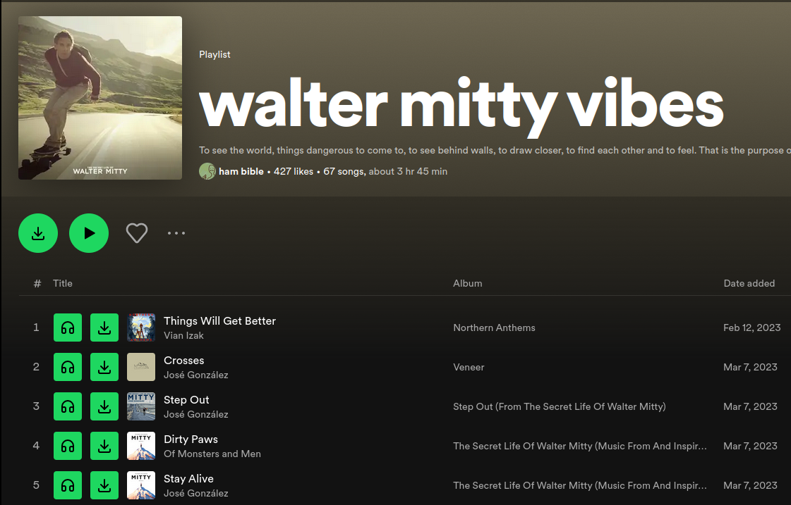

<div align="center">
<h1>Spotdl Web script</h1>
 


</div>

______________________________________________________________________

This script add buttons in web spotify to easier download/lisent music through [spotdl](https://github.com/spotDL/spotify-downloader)

### Instalation
 - You need `python3`
 - you need [spotdl](https://github.com/spotDL/spotify-downloader?tab=readme-ov-file#installation)
 - Add [tampermonkey](https://www.tampermonkey.net/) in your web browser
 - Add the client.js script in `tampermonkey`

### Usage
run the spotdl interaction server
```sh
python3 server.py

# you can change output ( default see python3 server.py --help)
python3 server.py --output ~/My/Music/Folder
```

go to your web browser https://open.spotify.com, and have fun !
